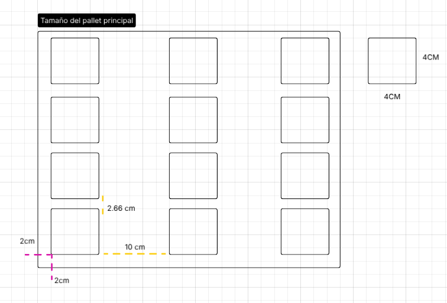
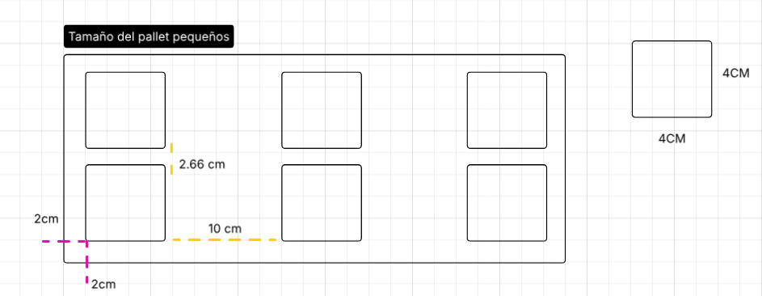
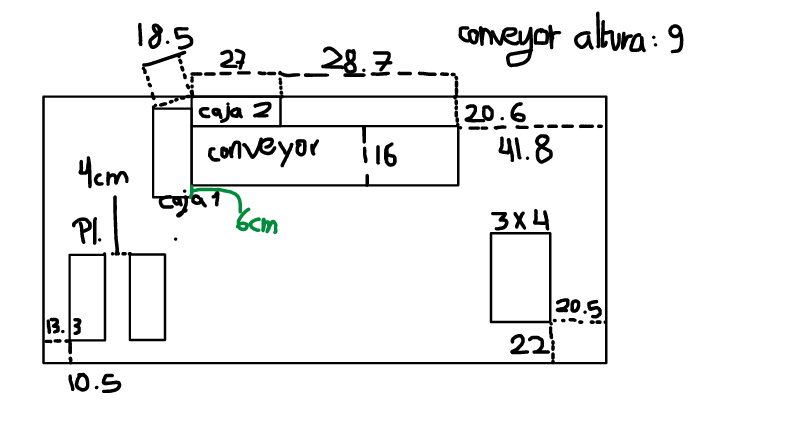
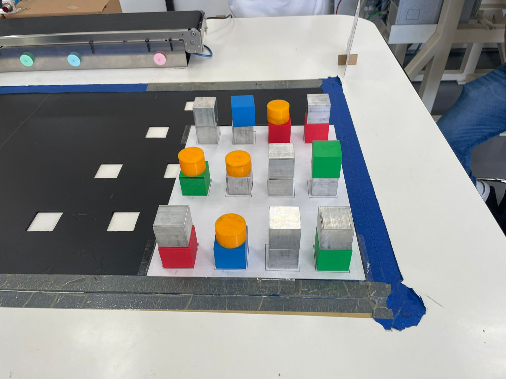
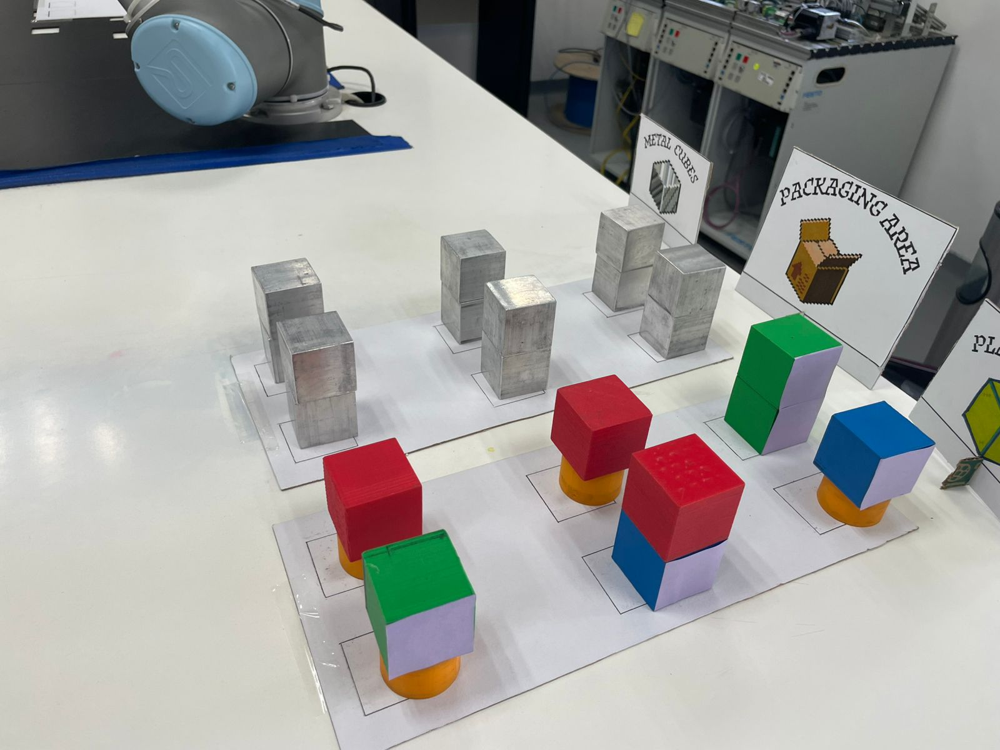
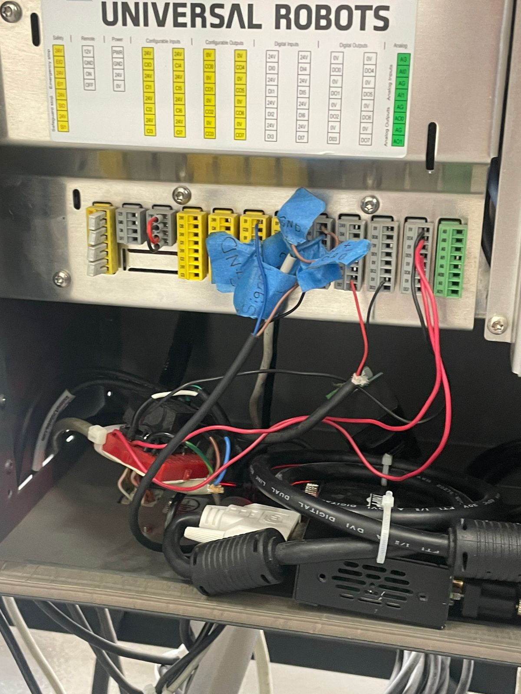
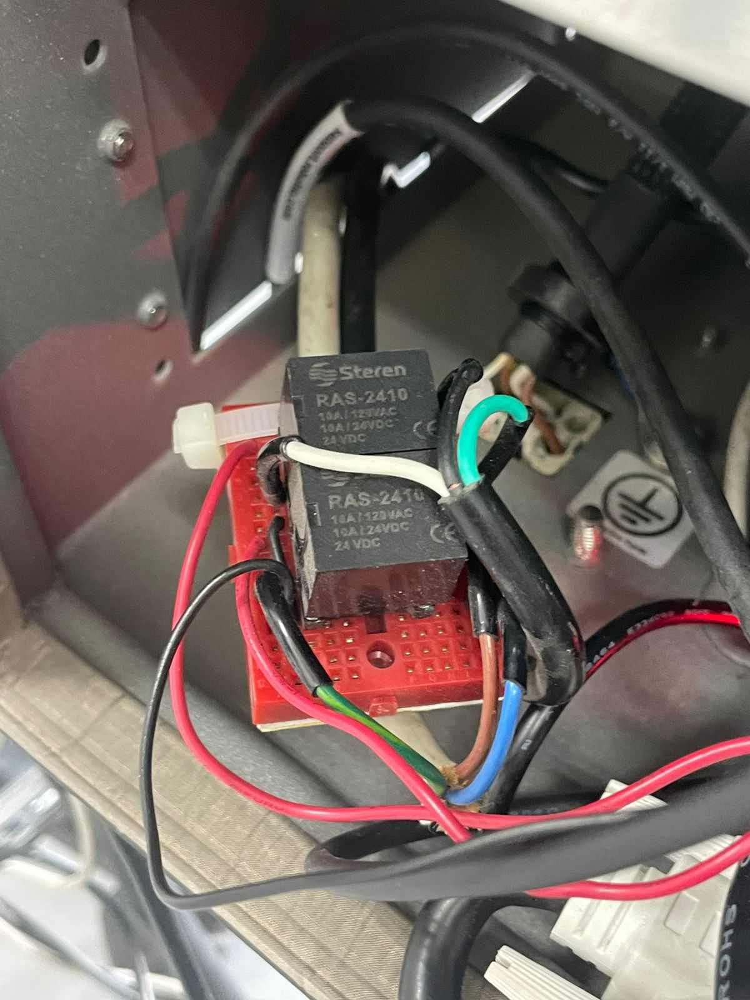
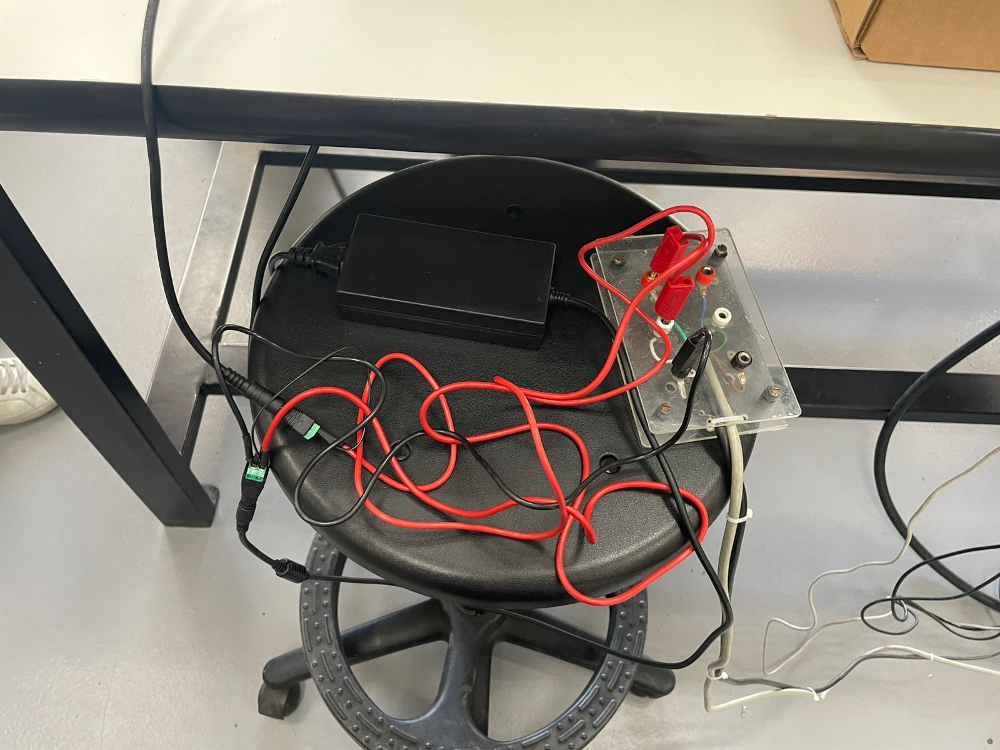

# Proyecto: Línea de empaquetado con separación de material 👾

Este proyecto consiste en una línea de empaque automatizada encargada de transportar, clasificar y separar los productos según su material (Metal o plástico). El sistema utiliza sensores para realizar la clasificación de cada producto a su área correspondiente, optimizando el proceso de selección, reduciendo errores y mejorando la eficiencia de producción.

## 📋 Requisitos Previos: 

* Conocimientos necesarios (Ur5 capacitación, conocimientos de cinemática.)
* Componentes electrónicos o mecánicos necesarios (Sensor de detección de metal, sensor de detección de objetos, conveyor)
* Software necesario (Polyscope). 

## 📖 Introducción

En la actualidad uno de los principales propósitos dentro del área industrial, es la automatización, ya que ha revolucionado los procesos de manufactura y empaque, permitiendo aumentar la eficiencia, reducir costos y minimizar errores humanos en las líneas de producción. Actualmente, la implementación de sistemas inteligentes de clasificación representa una solución fundamental para optimizar el manejo de materiales dentro de la industria.
El presente proyecto consiste en el diseño e implementación de una línea de empaque automatizada capaz de transportar, detectar y separar productos de acuerdo con su material, específicamente metal y plástico. Para lograrlo, el sistema emplea sensores que identifican las características de cada objeto y mecanismos de control que permiten dirigirlos automáticamente hacia el área correspondiente.
Mediante esta propuesta se busca mejorar el proceso de selección de materiales, incrementar la rapidez de operación y garantizar una mayor precisión en la clasificación de productos. Además, el proyecto integra conocimientos de automatización, electrónica y control, aplicando tecnologías utilizadas en entornos industriales reales.

## 🔩 Materiales
Lista detallada de componentes y materiales con cantidades aproximadas:
* 1x Conveyor
* 12x Cubos de plástico
* 12x Cubos de metal
* 1x Pallete 3*4
* 2x Pallete 3*4
* Relevador 24v
* 2x pares cables banana pin 

## 💾 Instalación de Software
Uso del polyscope en UR5, no instalación necesaria 

## ⚙️ Montaje y Ensamblado
Paso1: Primero se generan los diseños de los pallets necesarios para la clasificación, en el caso del mas grande para colocar los 24 cubos de manera aleatoria de manera apilada y 2 pallets para colocar los 12 cubos correspondientes a cada material utilizado, las medidas de los pallets utilizados son los siguientes.

Medidas del Pallet principal: 

  

Medidas de los pallets secundarios: 

  

Paso 2: Una vez creado los pallets se colocan en la mesa del ur5 para establecer la posición fija de los 3, las posiciones utilizadas para el proyecto fueron los siguientes, así también se colocaron el conveyor y las bases para los sensores del ur5, a continuacion una muestra de la ubicación de los objetos utilizados. 

  

Paso 3: Comprobar como quedan los cubos en ambas secciones para asegurar que el robot realize el trabajo correspondiente. 

  
   

Paso 4: (Opcional) Se pueden agregar carteles para darle un detalle. 

## 🔌 Conexiones Eléctricas

Se genero la conexión entre el conveyor y el ur5, se toma  como referencia la caja de salidas del ur5, fue necesario el uso de un relevador ubicado dentro de la caja de salidas y entradas. 

   
  
   

## 💻 Programación

- El sistema inicia encendiendo la salida digital `DO[4]`, indicando el arranque de la línea o sistema automatizado.

- El robot realiza movimientos articulados (`MoverJ`) y lineales (`MoverL`) para posicionarse de manera segura y precisa durante las operaciones de recolección y acomodo.

- Se ejecuta un bucle de **48 ciclos**, permitiendo procesar múltiples piezas automáticamente.

- El sensor `digital_in[0]` detecta la presencia de un objeto:
  - Si detecta material, el robot toma la pieza con el gripper.
  - Si no detecta material, el robot ejecuta otra rutina de alimentación o acomodo.

- El gripper realiza operaciones de apertura y cierre para sujetar y liberar las piezas durante el proceso.

- El sensor `digital_in[1]` se utiliza para clasificar el material:
  - Si es verdadero, el objeto se coloca en un pallet específico.
  - Si es falso, el objeto se dirige a otro pallet diferente.

- El sistema utiliza patrones de palletizado tipo **“Caja”**, organizando automáticamente las piezas en posiciones definidas por esquinas y puntos de aproximación.

- Se incluyen tiempos de espera (`Esperar`) para asegurar estabilidad mecánica y sincronización del proceso.

- Al finalizar los **48 ciclos**:
  - Se apaga la salida `DO[4]`.
  - El sistema muestra un aviso indicando que el pallet terminó y solicita recolectar los pallets y cargar más piezas.

- Existen eventos automáticos asociados a `digital_in[0]`:
  - Si la entrada permanece activa, el sistema se detiene temporalmente.
  - Si la entrada se desactiva, el sistema vuelve a encenderse automáticamente.

## ✅ Conclusión
El desarrollo de esta línea de empaque automatizada permitió implementar un sistema capaz de transportar, detectar, clasificar y acomodar productos de manera eficiente utilizando sensores y un robot industrial como el UR5. Gracias a la automatización del proceso, se logró reducir la intervención humana, disminuir errores en la clasificación y optimizar los tiempos de operación.
Además, el proyecto integró conceptos de robótica, control industrial y automatización, demostrando cómo el uso de sensores digitales y rutinas programadas puede mejorar significativamente los procesos de producción y empaque en entornos industriales. El sistema de paletizado también permitió organizar los productos de forma ordenada y precisa, aumentando la eficiencia y seguridad del proceso.
En conclusión, este proyecto representa una aplicación práctica de tecnologías industriales modernas, mostrando el impacto positivo de la automatización en la productividad, la calidad y la optimización de recursos dentro de una línea de producción.

A continuacion, el link de abajo es la carpeta de google drive donde se encuentra los videos de resultados finales. 

  

🔜 Mejoras futuras
•	Clasificación por figuras. 
⚠️ Advertencia
Como se indica en la licencia MIT, este software/hardware se proporciona sin ningún tipo de garantía. Por lo tanto, ningún colaborador es responsable de cualquier daño a tus componentes, materiales, PC, etc...

## 👥 Autores del proyecto
Jose Abel Ramirez Garcia
Ashley Michelle Rosa Corral

## 📬 Contacto
¿Tienes dudas o sugerencias?
•	📧 Correo electrónico: 

